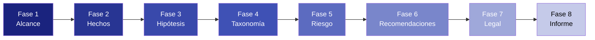

<p align="center">
  
  
  
  
  
</p>

# MTD-HX v2.0 — Framework de Investigación en Ciberseguridad

> Una metodología estructurada, con ética como prioridad, para conducir investigaciones de hipótesis en ciberseguridad — desde la identificación de amenazas hasta el reporte formal.

**Mantenedor:** [hoxtxnDev](https://github.com/hoxtxnDev)

---

## Sobre el Nombre

**MTD-HX** = **M**ethodology for **T**hreat **D**ocumentation — **H**ypothesis (Metodología de Documentación de Amenazas — Hipótesis).

MTD-HX es un framework de 8 fases, basado en plantillas reutilizables, para producir informes de investigación en ciberseguridad técnicamente rigurosos y legalmente fundamentados a partir de **información públicamente disponible solamente**. No es un toolkit de hacking — es una **metodología de documentación y análisis**.

El framework fue validado a través del caso de estudio de la **filtración de datos de Clínica Dávila (diciembre 2025)**, correlacionando datos filtrados con plataformas públicas de consulta de RUT chileno.

---

## ¿Para Quién Es Esto?

| Rol | Cómo Ayuda MTD-HX |
|---|---|
| Investigador de Seguridad | Formulación estructurada de hipótesis con trazabilidad MITRE ATT&CK |
| Pentester | Definición de alcance pre-engagement + reportes basados en riesgo |
| Respondedor de Incidentes | Documentación forense de hechos + timeline de divulgación legal |
| CISO / Gerente de Seguridad | Recomendaciones con puntuación CVSS 4.0 + segmentación por stakeholder |
| Legal / Cumplimiento | Obligaciones mapeadas bajo Ley 19.628, Ley 21.663, protocolos CSIRT |
| Academia | Metodología reproducible para papers de investigación en ciberseguridad |

---

## Resumen de la Metodología



| Fase | Descripción | Template |
|---|---|---|
| **1. Definición de Alcance** | Objetivos, límites, restricciones éticas y ley aplicable | [`ES`](./templates/es/01-scope.md) · [`EN`](./templates/en/01-scope.md) |
| **2. Hechos Verificados** | Solo información públicamente verificable con fuentes | [`ES`](./templates/es/02-facts.md) · [`EN`](./templates/en/02-facts.md) |
| **3. Hipótesis Técnica** | Vector de ataque con mapeo a técnica MITRE ATT&CK | [`ES`](./templates/es/03-hypothesis.md) · [`EN`](./templates/en/03-hypothesis.md) |
| **4. Taxonomía del Ataque** | Clasificación vía tácticas MITRE ATT&CK + categorías OWASP | [`ES`](./templates/es/04-taxonomy.md) · [`EN`](./templates/en/04-taxonomy.md) |
| **5. Análisis de Riesgo** | Puntuación CVSS 4.0 con desglose completo de métricas Base | [`ES`](./templates/es/05-risk.md) · [`EN`](./templates/en/05-risk.md) |
| **6. Recomendaciones** | Mitigaciones accionables por stakeholder (CISO/Dev/Legal/Exec) | [`ES`](./templates/es/06-recommendations.md) · [`EN`](./templates/en/06-recommendations.md) |
| **7. Marco Legal** | Mapeo a artículos específicos + registro de divulgación responsable | [`ES`](./templates/es/07-legal.md) · [`EN`](./templates/en/07-legal.md) |
| **8. Informe Final** | Resumen ejecutivo + cuerpo técnico + anexos | [`ES`](./templates/es/08-report-template.md) · [`EN`](./templates/en/08-report-template.md) |

---

## Inicio Rápido — Caso Clínica Dávila (3 Pasos)

### Paso 1: Alcance + Hechos
Abre [`01-scope.md`](./templates/es/01-scope.md) y define los límites de tu análisis. Para el caso Clínica Dávila:

```yaml
case_id: "CD-2025-001"
objective: "Determinar si un actor malicioso pudo correlacionar los datos
           filtrados de Clínica Dávila (diciembre 2025) con plataformas
           públicas de consulta de RUT usando el RUT como campo pivot."
in_scope:
  - Notificaciones de brecha y reportes de prensa pública
  - Plataformas públicas de consulta de RUT (SII, etc.)
  - Análisis de viabilidad técnica de ataques de enriquecimiento de datos
out_of_scope:
  - Acceder o descargar el dataset filtrado real
  - Explotación activa de cualquier sistema
  - Verificación de datos de individuos específicos
```

### Paso 2: Hipótesis + Taxonomía
Abre [`03-hypothesis.md`](./templates/es/03-hypothesis.md) y formula el modelo de ataque:

```yaml
hypothesis: "Un actor con acceso al dataset filtrado de Clínica Dávila podría
             usar números RUT como llaves pivot contra APIs públicas de
             consulta para enriquecer cada registro con PII adicional,
             produciendo un perfil consolidado por individuo."
mitre_technique: "T1589.002 — Recopilar Información de Identidad de la Víctima: Direcciones de Correo"
mitre_tactic: "TA0042 — Desarrollo de Recursos"
```

### Paso 3: Riesgo + Informe
Puntúa el vector con [`05-risk.md`](./templates/es/05-risk.md) usando CVSS 4.0:

```
Vector CVSS 4.0: CVSS:4.0/AV:N/AC:L/AT:N/PR:N/UI:N/VC:H/VI:L/VA:N/SC:H/SI:N/SA:N
Puntaje Base: 9.3 (Crítico)
```

Luego compila todo en [`08-report-template.md`](./templates/es/08-report-template.md).

---

## Comparación: MTD-HX vs Otros Frameworks

| Dimensión | MTD-HX | PTES | OWASP Testing Guide |
|---|---|---|---|
| Enfoque | Investigación y documentación de hipótesis | Ejecución de pruebas de penetración | Seguridad en aplicaciones web |
| Fases | 8 (Alcance → Informe) | 7 (Pre-engagement → Reporte) | 12 (Recopilación → Reporte) |
| Taxonomía de Amenazas | MITRE ATT&CK + STRIDE | Personalizada | WASC + OWASP Top 10 |
| Puntuación de Riesgo | CVSS 4.0 (métricas Base completas) | DREAD / Personalizada | CVSS 3.x |
| Mapeo Legal | Integrado (enfocado en ley chilena, extensible) | No incluido | No incluido |
| Aplicación de Ética | Explícito in-scope/out-of-scope + declaración firmada | Implícito | Implícito |
| Bilingüe | ES/EN nativo | Solo inglés | Solo inglés |
| Basado en Plantillas | 8 plantillas reutilizables por fase | Solo listas de verificación | Solo listas de verificación |
| Ideal Para | Investigadores, respondedores de incidentes, compliance | Pentesters, equipos red team | Testers de seguridad web |

---

## Estructura del Repositorio

```
MTD-HX/
├── README.md                      ← English version
├── README.es.md                   ← Estás aquí
├── CHANGELOG.md                   ← Versionado semántico
├── CONTRIBUTING.md                ← Cómo contribuir
├── SECURITY.md                    ← Política de divulgación responsable
├── LICENSE                        ← MIT
├── docs/
│   ├── en/methodology.md          ← Guía completa de metodología (EN)
│   └── es/metodologia.md          ← Guía completa de metodología (ES)
└── templates/
    ├── en/                         ← English templates (primary)
    │   ├── 01-scope.md
    │   ├── 02-facts.md
    │   ├── 03-hypothesis.md
    │   ├── 04-taxonomy.md
    │   ├── 05-risk.md
    │   ├── 06-recommendations.md
    │   ├── 07-legal.md
    │   └── 08-report-template.md
    ├── es/                         ← Spanish templates (secondary)
    │   ├── 01-scope.md
    │   ├── 02-facts.md
    │   ├── 03-hypothesis.md
    │   ├── 04-taxonomy.md
    │   ├── 05-risk.md
    │   ├── 06-recommendations.md
    │   ├── 07-legal.md
    │   └── 08-report-template.md
    ├── 01-scope.md                ← Referencia bilingüe
    ├── 02-facts.md
    ├── 03-hypothesis.md
    ├── 04-taxonomy.md
    ├── 05-risk.md
    ├── 06-recommendations.md
    ├── 07-legal.md
    └── 08-report-template.md
```

---

## Principios Fundamentales

- Ética primero — Ningún dato de filtración fue accedido, descargado ni reproducido
- Transparencia de fuentes — Solo se documentan hechos públicamente verificables
- Fundamentación legal — Cada análisis se mapea a la legislación aplicable
- Reproducibilidad — Las plantillas permiten seguir el mismo proceso
- Divulgación responsable — Hallazgos reportados a autoridades competentes (PDI, CSIRT)

---

## Aviso Legal

Este framework y todos los casos de estudio asociados son producidos con **fines exclusivamente académicos e investigativos**. No se accedió, descargó ni reprodujo ningún dato de filtraciones. Todo el análisis se basa en información públicamente disponible.

Legislación chilena aplicable: Ley 19.628 (Protección de Datos), Ley 21.663 (Marco de Ciberseguridad).

---

## Licencia

MIT — Libre de usar, adaptar y construir sobre él con atribución. Ver [LICENSE](./LICENSE).
