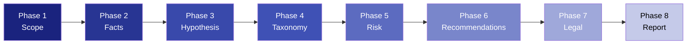

<p align="center">
  
  
  
  
  
</p>

# MTD-HX v2.0 — Cybersecurity Research Framework

> A structured, ethics-first methodology for conducting cybersecurity hypothesis research — from threat identification to formal reporting.

**Maintainer:** [hoxtxnDev](https://github.com/hoxtxnDev)

---

## About the Name

**MTD-HX** = **M**ethodology for **T**hreat **D**ocumentation — **H**ypothesis (Metodología de Documentación de Amenazas — Hipótesis).

MTD-HX is an 8-phase, template-driven framework for producing technically rigorous, legally grounded cybersecurity research reports from **publicly available information only**. It is not a hacking toolkit — it is a **documentation and analysis methodology**.

The framework was validated through the **Clínica Dávila data breach (December 2025)** case study, correlating leaked data with public Chilean RUT lookup platforms.

---

## Who Is This For?

| Role | How MTD-HX Helps |
|---|---|
| Security Researcher | Structured hypothesis formulation with MITRE ATT&CK traceability |
| Pentester | Pre-engagement scope definition + risk-based reporting |
| Incident Responder | Forensic fact documentation + legal disclosure timeline |
| CISO / Security Manager | Risk-scored recommendations with CVSS 4.0 + stakeholder targeting |
| Legal / Compliance | Mapped obligations under Ley 19.628, Ley 21.663, CSIRT protocols |
| Academia | Reproducible methodology for cybersecurity research papers |

---

## Methodology Overview



| Phase | Description | Template |
|---|---|---|
| **1. Scope Definition** | Define objectives, boundaries, ethical constraints, and applicable law | [`EN`](./templates/en/01-scope.md) · [`ES`](./templates/es/01-scope.md) |
| **2. Verified Facts** | Document only publicly verifiable information with sources | [`EN`](./templates/en/02-facts.md) · [`ES`](./templates/es/02-facts.md) |
| **3. Technical Hypothesis** | Formulate attack vector with MITRE ATT&CK technique mapping | [`EN`](./templates/en/03-hypothesis.md) · [`ES`](./templates/es/03-hypothesis.md) |
| **4. Attack Taxonomy** | Classify via MITRE ATT&CK tactics + OWASP categories | [`EN`](./templates/en/04-taxonomy.md) · [`ES`](./templates/es/04-taxonomy.md) |
| **5. Risk Analysis** | CVSS 4.0 scoring with full Base metric breakdown | [`EN`](./templates/en/05-risk.md) · [`ES`](./templates/es/05-risk.md) |
| **6. Recommendations** | Actionable mitigations per stakeholder (CISO / Dev / Legal / Exec) | [`EN`](./templates/en/06-recommendations.md) · [`ES`](./templates/es/06-recommendations.md) |
| **7. Legal Framework** | Map to specific legal articles + responsible disclosure log | [`EN`](./templates/en/07-legal.md) · [`ES`](./templates/es/07-legal.md) |
| **8. Final Report** | Executive summary + technical body + appendices | [`EN`](./templates/en/08-report-template.md) · [`ES`](./templates/es/08-report-template.md) |

---

## Quick Start — Clínica Dávila Case (3 Steps)

### Step 1: Scope + Facts
Open [`01-scope.md`](./templates/en/01-scope.md) and define the boundaries of your analysis. For the Clínica Dávila case:

```yaml
case_id: "CD-2025-001"
objective: "Determine if a malicious actor could correlate the December 2025
           Clínica Dávila breach data with public RUT lookup platforms using
           RUT as a pivot field."
in_scope:
  - Public breach notifications and news reports
  - Public RUT consultation platforms (Servicio de Impuestos Internos, etc.)
  - Technical viability analysis of data enrichment attacks
out_of_scope:
  - Accessing or downloading the actual leaked dataset
  - Active exploitation of any system
  - Verification of specific individuals' data
```

### Step 2: Hypothesis + Taxonomy
Open [`03-hypothesis.md`](./templates/en/03-hypothesis.md) and formulate the attack model:

```yaml
hypothesis: "An actor with access to the Clínica Dávila leaked dataset could
             use RUT numbers as pivot keys against public lookup APIs to
             enrich each record with additional PII, producing a consolidated
             profile per individual."
mitre_technique: "T1589.002 — Gather Victim Identity Information: Email Addresses"
mitre_tactic: "TA0042 — Resource Development"
```

### Step 3: Risk + Report
Score the vector with [`05-risk.md`](./templates/en/05-risk.md) using CVSS 4.0:

```
CVSS 4.0 Vector: CVSS:4.0/AV:N/AC:L/AT:N/PR:N/UI:N/VC:H/VI:L/VA:N/SC:H/SI:N/SA:N
Base Score: 9.3 (Critical)
```

Then compile everything into [`08-report-template.md`](./templates/en/08-report-template.md).

---

## Comparison: MTD-HX vs Other Frameworks

| Dimension | MTD-HX | PTES | OWASP Testing Guide |
|---|---|---|---|
| Focus | Hypothesis research & documentation | Penetration testing execution | Web application security |
| Phases | 8 (Scope → Report) | 7 (Pre-engagement → Reporting) | 12 (Info Gathering → Reporting) |
| Threat Taxonomy | MITRE ATT&CK + STRIDE | Custom | WASC + OWASP Top 10 |
| Risk Scoring | CVSS 4.0 (full Base metrics) | DREAD / Custom | CVSS 3.x |
| Legal Mapping | Built-in (Chilean law focused, extensible) | Not included | Not included |
| Ethics Enforcement | Explicit in-scope/out-of-scope + signed declaration | Implicit | Implicit |
| Bilingual | ES/EN native | English only | English only |
| Template-Driven | 8 reusable templates per phase | Checklists only | Checklists only |
| Best For | Researchers, incident responders, compliance | Pentesters, red teams | Web app security testers |

---

## Repository Structure

```
MTD-HX/
├── README.md                      ← You are here
├── README.es.md                   ← Versión en español
├── CHANGELOG.md                   ← Semantic versioning
├── CONTRIBUTING.md                ← How to contribute
├── SECURITY.md                    ← Responsible disclosure policy
├── LICENSE                        ← MIT
├── docs/
│   ├── en/methodology.md          ← Full methodology guide (EN)
│   └── es/metodologia.md          ← Guía completa de metodología (ES)
└── templates/
    ├── en/                         ← English templates (primary)
    │   ├── 01-scope.md
    │   ├── 02-facts.md
    │   ├── 03-hypothesis.md
    │   ├── 04-taxonomy.md
    │   ├── 05-risk.md
    │   ├── 06-recommendations.md
    │   ├── 07-legal.md
    │   └── 08-report-template.md
    ├── es/                         ← Spanish templates (secondary)
    │   ├── 01-scope.md
    │   ├── 02-facts.md
    │   ├── 03-hypothesis.md
    │   ├── 04-taxonomy.md
    │   ├── 05-risk.md
    │   ├── 06-recommendations.md
    │   ├── 07-legal.md
    │   └── 08-report-template.md
    ├── 01-scope.md                ← Bilingual reference
    ├── 02-facts.md
    ├── 03-hypothesis.md
    ├── 04-taxonomy.md
    ├── 05-risk.md
    ├── 06-recommendations.md
    ├── 07-legal.md
    └── 08-report-template.md
```

---

## Key Principles

- Ethics first — No actual breach data accessed, downloaded, or reproduced
- Source transparency — Only publicly verifiable facts are documented
- Legal grounding — Every analysis maps to applicable legislation
- Reproducibility — Templates allow any researcher to follow the same process
- Responsible disclosure — Findings reported to competent authorities (PDI, CSIRT)

---

## Legal Notice

This framework and all associated case studies are produced for **academic and investigative purposes only**. No breach data was accessed, downloaded, or reproduced. All analysis is based exclusively on publicly available information.

Applicable Chilean law: Ley 19.628 (Data Protection), Ley 21.663 (Cybersecurity Framework).

---

## License

MIT — Free to use, adapt, and build upon with attribution. See [LICENSE](./LICENSE).
